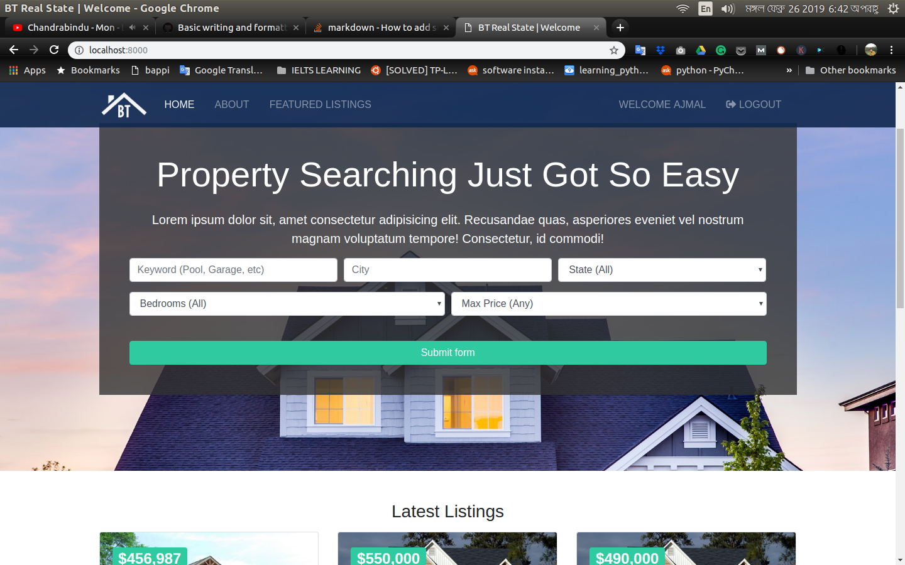
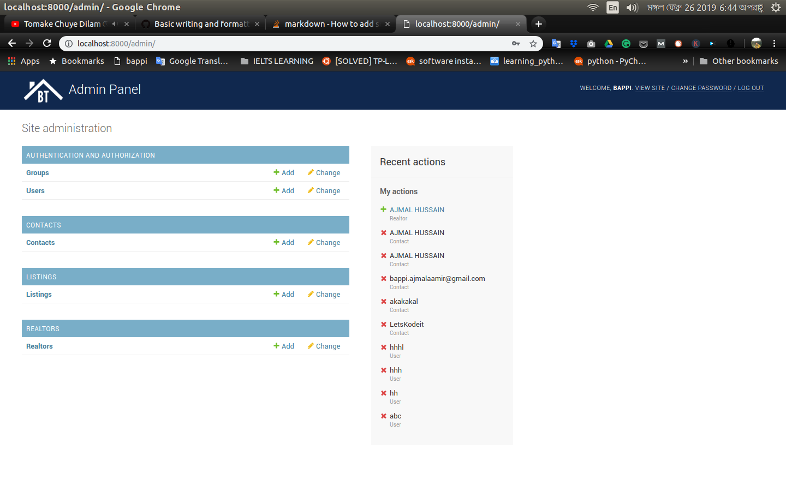
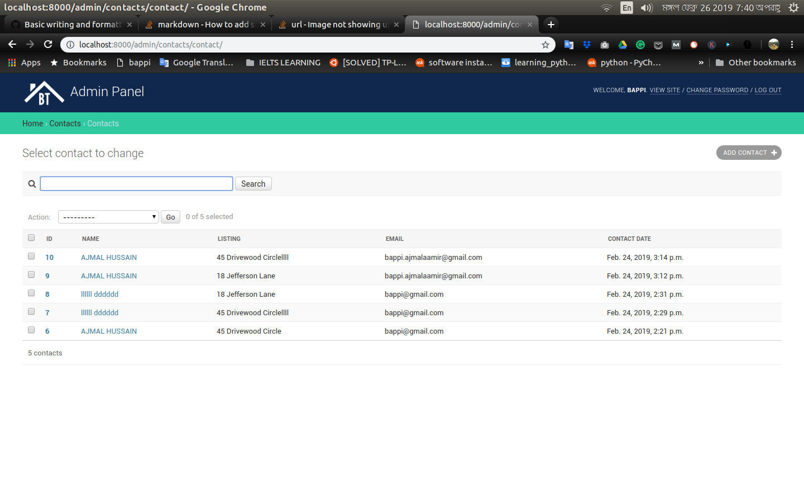

## Django Real state project by Ajmal Hussain
A dynamic django website with postgresql and bootstrap template for publishing real state property
with django admin panel and user dashboard.

## Uses 
If you know django, postgresql, bootstrap you can easily modify html template 
and backend according to your project needs.You can change the images in static directory in the project, and add 
contents from you or your client's requirements. To know how to setup, follow the table of contents.

# Table of Contents


- [Technology Used](#technology-used)
- [Cyrrent Features](#features)
- [Setup in local machine](#setup-in-local-machine)
- [Setup PostgreSQL in local machine](#setup-postgresql-in-local-machine)
- [How to use admin panel to manage contents](#how-to-use-admin-panel-to-manage-contents)


## Technology Used
1. [Django](https://www.djangoproject.com/)
2. [PostgreSQL](https://www.postgresql.org)
3. [Bootstrap](https://getbootstrap.com/)


## Current Features
1. Responsive single page webapp
2. Admin Panel for Property Management 
3. Search Engine 
4. User Login
5. User Registration
6. User Dashboard

## Setup python and virtual environment in local machine

```
sudo apt-get install python3
sudo pip install virtualenv
virtualenv --python=python3 venv
source venv/bin/activate
``` 

Ok now your machine is ready to rock. Now you can work with this project.
Let assume our project name will be django_startup

1. First clone this project or fork and clone your fork url
```
git clone https://github.com/bappi2016/Django_real_state.git
cd django_startup # Or Enter the project dir here my dir name is django_startup
```

2. Now run and install django 

```
pip install django 
``` 
3. Check the version of django 

```
python -m django –version
```


### Setup PostgreSQL in local machine

1. Downlaod and install [PostgreSQL](https://www.postgresql.org/download/) 
2. Run the PostgreSQL in your machine
3. Download [pgAdmin](https://www.pgadmin.org) if you prefer managing PostgreSQL visually
4. Run pgAdmin to create database visually
5. Or Create a database in PostgreSQL in terminal
6. Update django frameworks's project settings django_startup/djangostartup/settings.py

```Python
DATABASES = {
    "default": {
    
        "ENGINE": "django.db.backends.postgresql",
        "NAME": "YOUR_LOCAL_DB_NAME",
        "USER": "YOUR_POSTGRESQL_USER_NAME",
        "PASSWORD": "YOUR_POSTGRESQL_PASSWORD",
        "HOST": "localhost",
}  }

``` 

7. Apply database migration from django to postgresql
This will convert all the models to SQL tables in postgresql

```
python3 manage.py migrate
```

8. Start django server locally
```
python3 manage.py runserver
```

9. Visit http://127.0.0.1:8000/ in a web browser to see the following webpage.

<p align="center">
    
</p>

10. Quit the server with CONTROL-C in terminal 
```shell
CONTROL-C
```   
## How to use admin panel to manage contents

1. First create a superuser
```shell
python3 manage.py createsuperuser
```
2. Now run the server again
```shell
python3 manage.py runserver
```
3. Now in web browser visit http://127.0.0.1:8000/admin . Login with the superuser name and password you created already.

You will see the following admin panel with 4 Models 
AUTHENTICATION AND AUTHORIZATION,
CONTACTS
LISTINGS
REALTORS


<p align="center">
    
</p>	

4. Now Click on the models to see the tables.

5. Now to add a contacts. Click the [+ Add] button

You will see the following form

<p align="center">
    
</p>	

Now fill the form for our demo purpose. In later you can modify/remove/add anything according to your requirements. After filling, SAVE the form.
